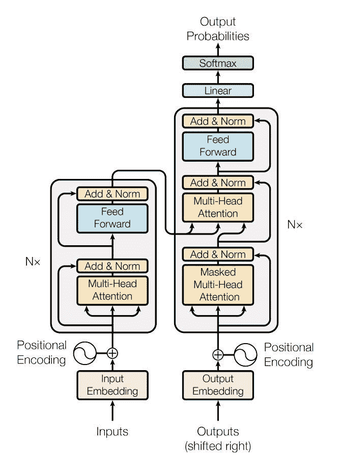
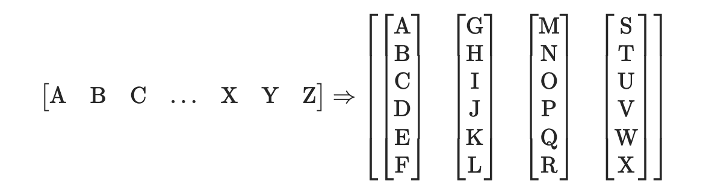
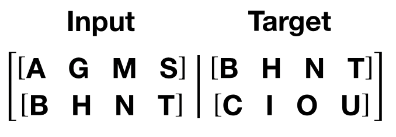

# LANGUAGE MODELING WITH NN.TRANSFORMER AND TORCHTEXT

## Introduce 

* Rsource Link : [English](https://pytorch.org/tutorials/beginner/transformer_tutorial.html)

This tutorial includes a standard transformer module based on the paper **Attention is All You Need**. Compared to Recurrent Neural Networks (RNNs), the transformer model has proven to be superior in quality for many sequence-to-sequence tasks while being more parallelizable. The `nn.Transformer` module relies entirely on an attention mechanism (implemented as nn.MultiheadAttention) to draw global dependencies between input and output. The `nn.Transformer` module is highly modularized such that a single component (e.g., nn.TransformerEncoder) can be easily adapted/composed.

    

## Define the model

In this tutorial, we train a nn.TransformerEncoder model on a language modeling task. The language modeling task is to assign a probability for the likelihood of a given word (or a sequence of words) to follow a sequence of words. A sequence of tokens are passed to the embedding layer first, followed by a positional encoding layer to account for the order of the word (see the next paragraph for more details). The nn.TransformerEncoder consists of multiple layers of nn.TransformerEncoderLayer. Along with the input sequence, a square attention mask is required because the self-attention layers in nn.TransformerEncoder are only allowed to attend the earlier positions in the sequence. For the language modeling task, any tokens on the future positions should be masked. To produce a probability distribution over output words, the output of the nn.TransformerEncoder model is passed through a linear layer followed by a log-softmax function.

## Load and batch data

This tutorial uses `torchtext` to generate Wikitext-2 dataset. The vocab object is built based on the train dataset and is used to numericalize tokens into tensors. Wikitext-2 represents rare tokens as 

Given a 1-D vector of sequential data, `batchify()` arranges the data into `batch_size` columns. If the data does not divide evenly into `batch_size` columns, then the data is trimmed to fit. For instance, with the alphabet as the data (total length of 26) and `batch_size=4`

    

# Functions to generate input and target sequence

`get_batch()` generates a pair of input-target sequences for the transformer model. It subdivides the source data into chunks of length `bptt`. For the language modeling task, the model needs the following words as `Target`. For example, with a `bptt` value of 2, we’d get the following two Variables for i = 0:

    

